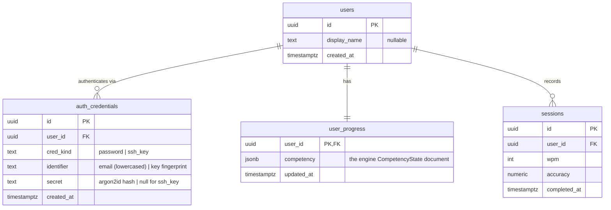

# Database Schema

> Reflects the decisions in [ADR 0005 (sqlc + goose)](/docs/adr/0005-sqlc-and-goose.md), [ADR 0010 (unified identity + JWT)](/docs/adr/0010-unified-identity-and-jwt.md) , and the [adaptive-engine design doc](/docs/adaptive-engine.md) (competency persisted as a JSONB document that maps 1:1 to the engine's `CompetencyState`).

## Overview

Four tables. Identity is decoupled from credentials; competency is one JSONB document per user; sessions are a normal relational table because they are queried (history, WPM-over-time). There is **no** raw-keystroke table - the client aggregates per-item stats and submits a summary, so the keystroke volume never reaches the database. Anonymous SSH sessions are never persisted ([ADR 0008](/docs/adr/0008-ssh-public-key-authentication.md)), so they appear nowhere below.



## Why competency is JSONB, not normalised rows

The only access pattern in v1 is: load one user's entire competency state, run the pure engine, write the entire updated state back. Load-whole, write-whole, per user, per lesson. We never query "all users weak on `th`". Normalising to a row per `(user, key)` and `(user, ngram)` would mean hundreds of rows per user, a multi-row read to reconstruct state, and a multi-row upsert to persist - for query flexibility we never use. The JSONB document maps 1:1 to the engine's `CompetencyState`, which keeps the persistence layer thin.

If cross-user ngram analytics ever become a feature, _that_ is the trigger to migrate competency into a normalised `user_item_scores` table. The same table is the right home for per-item history if user-facing per-item improvement charts or offline re-tuning ever land - but not before: the [adaptive-engine doc](adaptive-engine.md) covers why a velocity signal for anti-plateau generation is maintained online (a scalar in the JSONB doc) rather than by storing a per-item time series. Until a consumer a scalar cannot feed appears, schema follows access pattern.

The `competency` document shape (this is exactly the engine's `CompetencyState`):

```json
{
  "keys": {
    "e": {
      "score": 0.91,
      "samples": 240,
      "last_practiced": "2026-06-16T09:00:00Z"
    },
    "t": {
      "score": 0.74,
      "samples": 180,
      "last_practiced": "2026-06-16T09:00:00Z"
    }
  },
  "ngrams": {
    "th": {
      "score": 0.62,
      "samples": 80,
      "last_practiced": "2026-06-16T09:00:00Z"
    }
  },
  "ngram_tier": 12,
  "target_wpm": 40
}
```

`target_wpm` lives in the document because the engine reads it as part of `CompetencyState`. It is tool-managed, not user-set: the engine starts it at 40 and raises it as the user improves ([ADR 0012](/docs/adr/0012-targets-set-by-tool-not-user.md)). If a settings screen later needs to query or update it independently, promote it to a column on `user_progress`.

## Notes on the relational tables

**`auth_credentials`.** The unique constraint `(cred_kind, identifier)` is both the integrity rule and the lookup index - login and SSH-key resolution both query by it. Emails are normalised to lowercase in the application before insert and lookup (simpler than a `citext` column when the column is polymorphic across credential kinds). `secret` is null for `ssh_key` rows.

**`sessions`.** The append-only time series of completed lessons, distinct from `user_progress.competency`: competency is a current-snapshot rolling aggregate (whole-document load-modify-write), while `sessions` is the queryable per-attempt history the WPM-over-time chart and history view read - the JSONB doc cannot serve those because the engine folds each lesson's `Observation` data into competency and then discards it. We store only the derived summary (`wpm`, `accuracy`, `completed_at`), never the lesson text: lessons are generated pseudo-words, so a "what did I type" replay is low value, and if replay or audit is ever wanted the right move is a nullable `jsonb` column for the raw observations (or the generator seed + resolved targets + corpus version, since regeneration depends on the competency state at generation time) rather than a text column now. Index `(user_id, completed_at DESC)` for history and progress-chart queries. History is paginated with a **keyset (seek) cursor**, not `OFFSET`: the opaque `cursor` in the API encodes the last row's `(completed_at, id)`, and the next page is `WHERE (completed_at, id) < (:completed_at, :id) ORDER BY completed_at DESC, id DESC LIMIT :n`. This rides the index above, stays correct when new sessions are inserted between page fetches, and does not degrade as the offset grows.

**`user_progress`.** One row per user, created atomically with the user at registration (a single transaction, which the modular monolith makes trivial - see [ADR 0003](/docs/adr/0003-modular-monolith.md)). PK on `user_id` is the only access path needed. The session-submit transaction loads this row `SELECT ... FOR UPDATE`: competency is a whole-document load-modify-write, so two concurrent submissions for the same user would otherwise be a lost-update hazard. The row lock serialises them; contention is per-user, so it is effectively never contended (cheaper than an optimistic version column plus client retry for this access pattern).

## Deferred tables

- **`refresh_tokens`** — introduced by [ADR 0015](/docs/adr/0015-access-and-refresh-tokens.md) (rotating refresh tokens: hashed token, user, expiry, rotation lineage). **Out of scope for the v1 vertical slice**, which authenticates with a single short-lived access token only; the table and the `/auth/refresh` flow land when refresh ships. Listed here so this doc tracks the full intended design rather than going stale against ADR 0015.

## Conventions

- UUIDs via `gen_random_uuid()` (built into Postgres).
- All foreign keys `ON DELETE CASCADE`: deleting a user removes their credentials, progress, and sessions.
- Migrations are numbered goose `.sql` files (ADR 0003), applied at startup under an advisory lock:
  - `0001_users`
  - `0002_auth_credentials`
  - `0003_user_progress`
  - `0004_sessions`
- `created_at` / `updated_at` / `completed_at` are all `timestamptz` (store UTC; never a naive timestamp).
